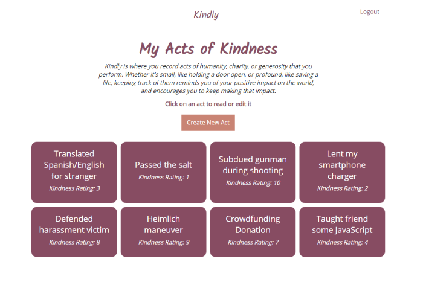
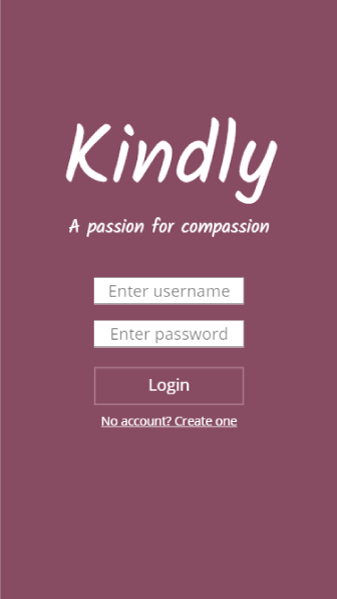
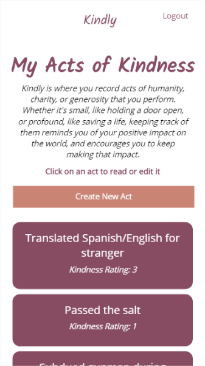

# Kindly

## Overview

An app that allows you to keep track of acts of kindness, charity, or generosity that you do for others.

## Screenshots

Home - Desktop

Dashboard - Desktop

Home - Mobile

Dashboard - Mobile

## Live Demo
[Link to Demo](http://kindlyactsofkindness.herokuapp.com)

## Demo Account
Username: user

Password: password

## Documentation 

#### Technologies used
* Node.js
* Express
* Passport
* MongoDB
* Mongoose
* Mocha/Chai
* HTML
* CSS
* jQuery
* JavaScript